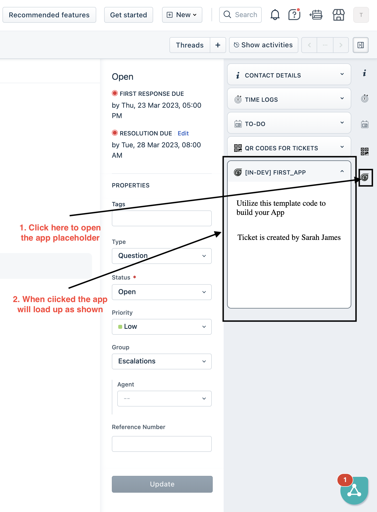

# App development guide to build your first app

This document will enable you to build your first freshworks application

## Build your First App using Freshworks CLI App Template

1. Ensure you have followed the steps given in [getting started guide](getting-started.md)
2. Navigate to `your_first_app` directory from CLI  
3. Run command `fdk run` to run the app
4. Navigate to your product page - https://[subdomain].[product].com/a/dashboard/sample Eg: https://paidappdemo.freshdesk.com/ 
   1. Navigate to a specific ticket - https://[subdomain].[product].com/a/tickets/[id] Eg.https://paidappdemo.freshdesk.com/a/tickets/3
   2. Append `?dev=true` or `&dev=true` in URI to include query param For example
   3. When to use when there is no query param in URI
    `https://paidappdemo.freshdesk.com/a/tickets/3?dev=true`
   4. To use when there is already a URI query param is present 
    `https://paidappdemo.freshservice.com/a/tickets/3?current_tab=details&dev=true` 
5. Navigate to [events page](http://localhost:10001/web/test)
6. Navigate to [custom config page](http://localhost:10001/custom_configs)

### Your First App

This app displays the name of the requester of a freshdesk ticket in the ticket_sidebar placeholder

#### Files and Folders
    .
    ├── README.md                 A file for your future self and developer friends to learn about app
    ├── app                       A folder to place all assets required for frontend components
    │   ├── index.html            A landing page for the user to use the app
    │   ├── scripts               JavaScript to place files frontend components business logic
    │   │   └── app.js
    │   └── styles                A folder to place all the styles for app
    │       ├── images
    │       │   └── icon.svg
    │       └── style.css
    ├── config                    A folder to place all the configuration files
    │   └── iparams.json
    └── manifest.json             A JSON file holding meta data for app to run on platform

Explore [more of app sample apps](https://community.developers.freshworks.com/t/freshworks-sample-apps/3604) on the Freshworks github respository.

## Expected outcome

When built app using mentioned steps your app must resemble to that of [first_app](../apps/first_app/)

When ran locally the app will result as shown below

## Next steps

Modify your app using placeholders by following [next steps](next-steps.md)
