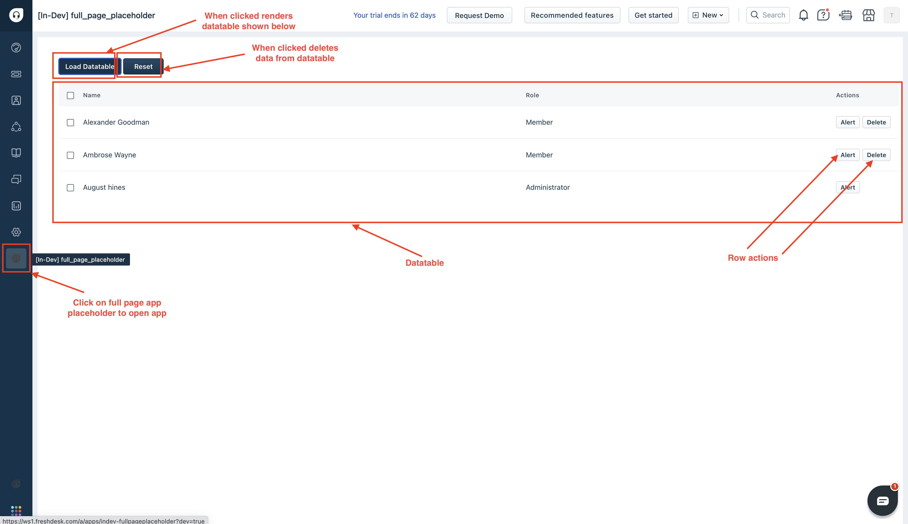

# Modify your full page placeholder page


1. Ensure you have followed the steps given in [getting started guide](getting_started.md)
2. Ensure you have built your first app using instructions given [instructions](app-dev-guide.md)
3. Ensure you have added placeholders using instructions
4. Update `app/views/full_page_app.html` content with the code below
    ```html
    <style>
        .ticket-page {
            padding-top: 2%;
            padding-left: 2%;
        }
    </style>
    <div class="ticket-page">
        <fw-button id="loadButton" onclick="loadDatatable()">Load Datatable</fw-button>
        <fw-button id="resetButton" onclick="reset()">Reset</fw-button>
        <br /><br />

        <fw-data-table id="datatable" is-selectable="true" is-all-selectable="true" label="Data table">
        </fw-data-table>
    </div>
    <script type="module" src="https://cdn.jsdelivr.net/npm/@freshworks/crayons@v4/dist/crayons/crayons.esm.js"></script>
    <script nomodule src="https://cdn.jsdelivr.net/npm/@freshworks/crayons@v4/dist/crayons/crayons.js"></script>

    <script>
        function loadDatatable() {
            var data = {
                columns: [{
                    "key": "name",
                    "text": "Name"
                }, {
                    "key": "role",
                    "text": "Role"
                }],
                rows: [{
                    "id": "0001",
                    "name": "Alexander Goodman",
                    "role": "Member"
                }, {
                    "id": "0002",
                    "name": "Ambrose Wayne",
                    "role": "Member"
                }, {
                    "id": "0003",
                    "name": "August hines",
                    "role": "Administrator"
                }],
                rowActions: [{
                    "name": "Alert",
                    "handler": (rowData) => {
                        window.alert(rowData.name);
                    }
                }, {
                    "name": "Delete",
                    "handler": async (rowData) => {
                        let deletePromise = new Promise((resolve, reject) => {
                            const dataTable = document.querySelector('#datatable');
                            setTimeout(() => {
                                if (dataTable) {
                                    dataTable.rows = dataTable.rows.filter((row) => (row.id !== rowData.id));
                                    resolve();
                                } else {
                                    reject();
                                }
                            }, 3000);
                        });
                        await deletePromise;
                    },
                    "hideForRowIds": ["0003"]
                }]
            }

            var datatable = document.getElementById('datatable');
            datatable.columns = data.columns;
            datatable.rows = data.rows;
            datatable.rowActions = data.rowActions;
        }
        function reset() {
            var datatable = document.getElementById('datatable');
            datatable.columns = '';
            datatable.rows = '';
        }
    </script>
    ```
5. Run command `fdk run` to run the app
6. Navigate to your product page - https://[subdomain].[product].com/a/dashboard/sample Eg: https://paidappdemo.freshdesk.com/ 
   1. Navigate to a specific ticket - https://[subdomain].[product].com/a/tickets/[id] Eg.https://paidappdemo.freshdesk.com/a/tickets/3
   2. Append `?dev=true` or `&dev=true` in URI to include query param For example
   3. When to use when there is no query param in URI
    `https://paidappdemo.freshdesk.com/a/tickets/3?dev=true`
   4. To use when there is already a URI query param is present 
    `https://paidappdemo.freshservice.com/a/tickets/3?current_tab=details&dev=true` 
7. Explore the app placeholders defined in manifest.json. The app must be visible under all of the defined placeholders

## Expected outcome

When built app using mentioned steps your app must resemble to that of [full page placeholder](../apps/full_page_placeholder/)

When run using `fdk run` the app should be loaded as shown below

